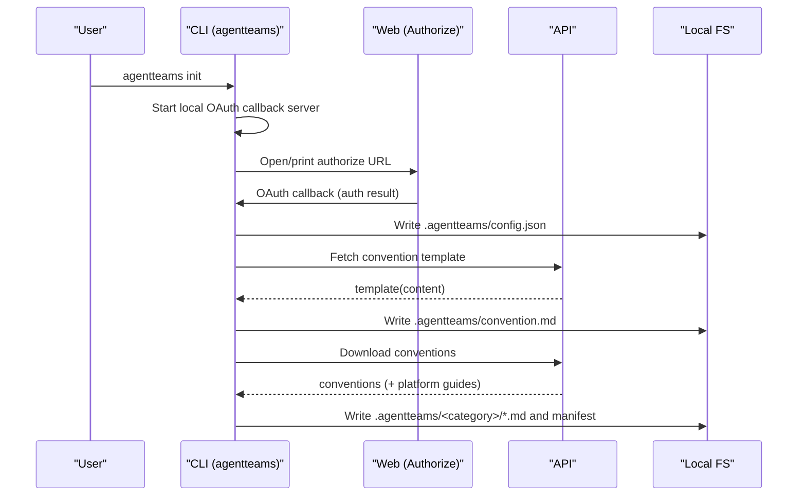
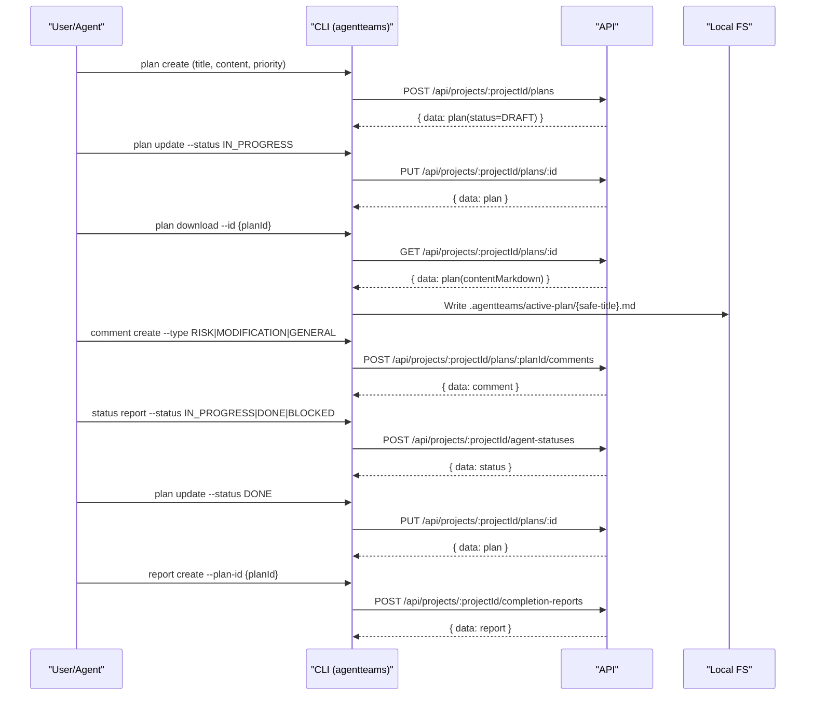
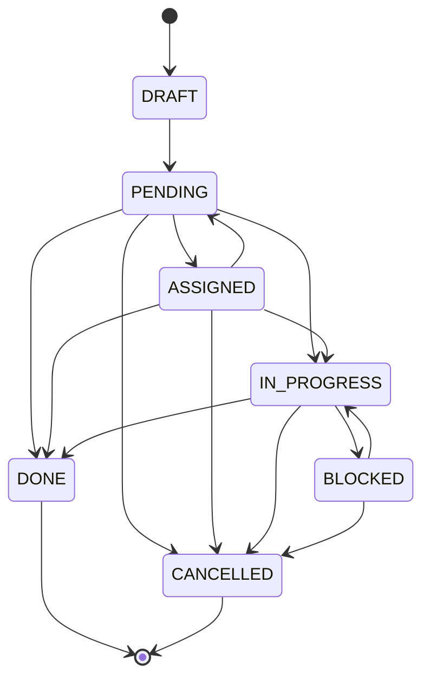
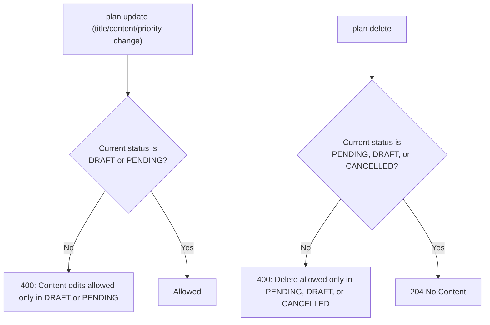

# API ↔ CLI Workflow

This document describes how the AgentTeams CLI (`agentteams`) talks to the API server, and how those calls translate into local files being created/updated in your workspace.

## Scope

- Auth/config loading rules used by the CLI
- Request/response conventions (envelopes, pagination)
- End-to-end workflows (Plan → Comments/Status → Completion Report → Postmortem)
- Local file locations created by the CLI

> The source of truth is the codebase. This document is an operational guide.

---

## Components and responsibilities

- CLI (`/cli`)
  - Command parsing via `commander`
  - HTTP calls via `axios`
  - Config loading (`.agentteams/config.json`, `~/.agentteams/config.json`, `AGENTTEAMS_*`)
  - Creates local artifacts (plan snapshots, downloaded conventions)
- API (`/api`)
  - REST API via Fastify
  - Auth (primarily `X-API-Key`) and permission checks
  - DB access via Prisma
  - Swagger UI at `/docs`

---

## Authentication and config loading

### `agentteams init` (first-time setup)

High-level flow:

1. Start a local OAuth callback server.
2. Open the authorize page in a browser (or print the URL in SSH environments).
3. Receive `apiUrl`, `apiKey`, `teamId`, `projectId`, `agentName` and persist them locally.
4. Save the convention template to `.agentteams/convention.md`.
5. Download all conventions into `.agentteams/*`.



### Config priority (highest → lowest)

1. CLI option overrides (some commands only)
2. Env vars `AGENTTEAMS_*`
3. Project config: nearest `.agentteams/config.json` found by walking up from `cwd`
4. Global config: `~/.agentteams/config.json`

Supported env vars:

- `AGENTTEAMS_API_KEY`
- `AGENTTEAMS_API_URL`
- `AGENTTEAMS_TEAM_ID`
- `AGENTTEAMS_PROJECT_ID`
- `AGENTTEAMS_AGENT_NAME`

### Default request headers

- `X-API-Key: key_...`
- `Content-Type: application/json`

API accepts either:

- `Authorization: Bearer <token>`
- `X-API-Key: key_...` (API keys must have the `key_` prefix)

---

## Common API conventions

### Base URL

The CLI calls `{apiUrl}/api/...`.

Example: `GET {apiUrl}/api/projects/{projectId}/plans`

### Response envelopes

- Single: `{ data: {...} }`
- List: `{ data: [...], meta: {...} }`

### Pagination

Many list endpoints accept `page` and `pageSize`.

---

## Command-focused workflows

### Plan

- Create: `POST /api/projects/:projectId/plans`
  - Plans are always created as `DRAFT` (server-enforced). Even if a client sends `status`, it will be ignored on creation.
  - Use `--content` or `--file` for the body.
- Download snapshot: `GET /api/projects/:projectId/plans/:id`
  - Saved to `.agentteams/active-plan/{safe-title}.md` with frontmatter.

### Comment (plan-scoped)

- List: `GET /api/projects/:projectId/plans/:planId/comments`
- Create: `POST /api/projects/:projectId/plans/:planId/comments`
- Get/Update/Delete by ID: `GET/PUT/DELETE /api/projects/:projectId/comments/:id`

Types: `RISK`, `MODIFICATION`, `GENERAL`

### Status

- Report: `POST /api/projects/:projectId/agent-statuses`
- List/Get/Update/Delete: `GET/PUT/DELETE /api/projects/:projectId/agent-statuses...`

### Convention

Convention commands are tightly coupled to `.agentteams/`.

- Sync download: `agentteams sync` (internally runs `convention download`)
  - Writes conventions and platform guides under `.agentteams/`
  - Updates `.agentteams/conventions.manifest.json`
- Create/Update/Delete: `agentteams convention create|update|delete`
  - Files are expected under `.agentteams/<category>/...`
  - `update/delete` default to a non-destructive preview; use `--apply` to execute.

### Completion report / Postmortem

- Completion reports: `.../completion-reports`
- Postmortems: `.../post-mortems`

CLI supports `--api-url`, `--api-key`, `--team-id`, `--project-id`, `--agent-name` overrides for environments without local config.

---

## Local files created by the CLI

- Project config: `.agentteams/config.json`
- Global config: `~/.agentteams/config.json`
- Convention template: `.agentteams/convention.md`
- Download manifest: `.agentteams/conventions.manifest.json`
- Plan snapshots: `.agentteams/active-plan/*.md`

---

## End-to-end: plan creation → completion report



---

## Plan status model and constraints

### Status values

- `DRAFT`
- `PENDING`
- `ASSIGNED`
- `IN_PROGRESS`
- `BLOCKED`
- `DONE` (terminal)
- `CANCELLED` (terminal)

### Allowed status transitions (server-validated)



If you attempt a disallowed transition, the API returns `400` with `허용되지 않은 상태 전이입니다`.

### `plan assign` behavior

`agentteams plan assign` sets the plan to `ASSIGNED` as long as the plan is not terminal.

- Not allowed when current status is `DONE` or `CANCELLED`
- Otherwise allowed and results in `ASSIGNED`

### Content edit/delete constraints (status-based)



---

## Completion report writing rules (practical)

- Prefer the platform template if available: `.agentteams/platform/guides/completion-report-guide.md`
- Include reproducible verification evidence (commands + outcomes).
- Keep outcomes short: write `pass/fail + 1–3 lines of summary`; do not paste long raw logs into the report body.

---

## Troubleshooting

- `401 Unauthorized`
  - Check `AGENTTEAMS_API_KEY` / `.agentteams/config.json` `apiKey`.
  - API keys must have the `key_` prefix.
- `403 Forbidden`
  - You likely lack project/role permissions (especially for convention writes).
- Connection issues (`ECONNREFUSED`, `ENOTFOUND`)
  - Check `AGENTTEAMS_API_URL` / config `apiUrl`, and ensure the server is reachable.

---

## Minimal usage examples

```bash
# First-time setup
agentteams init

# Create plan (always DRAFT)
agentteams plan create --title "My plan" --content "# TODO\n- ..." --priority MEDIUM

# Download local snapshot/runbook
agentteams plan download --id <planId>

# Add a risk comment
agentteams comment create --plan-id <planId> --type RISK --content "Potential failure mode..."

# Report agent status
agentteams status report --status IN_PROGRESS --task "Working on plan" --issues "" --remaining ""

# Move plan forward
agentteams plan update --id <planId> --status IN_PROGRESS
agentteams plan update --id <planId> --status DONE

# Create completion report
agentteams report create --plan-id <planId> --summary "Done" --content "## Summary\n- ...\n\n## Verification\n- ...\n"
```

Environment-only mode (no config file):

```bash
export AGENTTEAMS_API_URL="https://..."
export AGENTTEAMS_API_KEY="key_..."
export AGENTTEAMS_TEAM_ID="..."
export AGENTTEAMS_PROJECT_ID="..."
export AGENTTEAMS_AGENT_NAME="..."

agentteams plan list --page 1 --page-size 20
```
