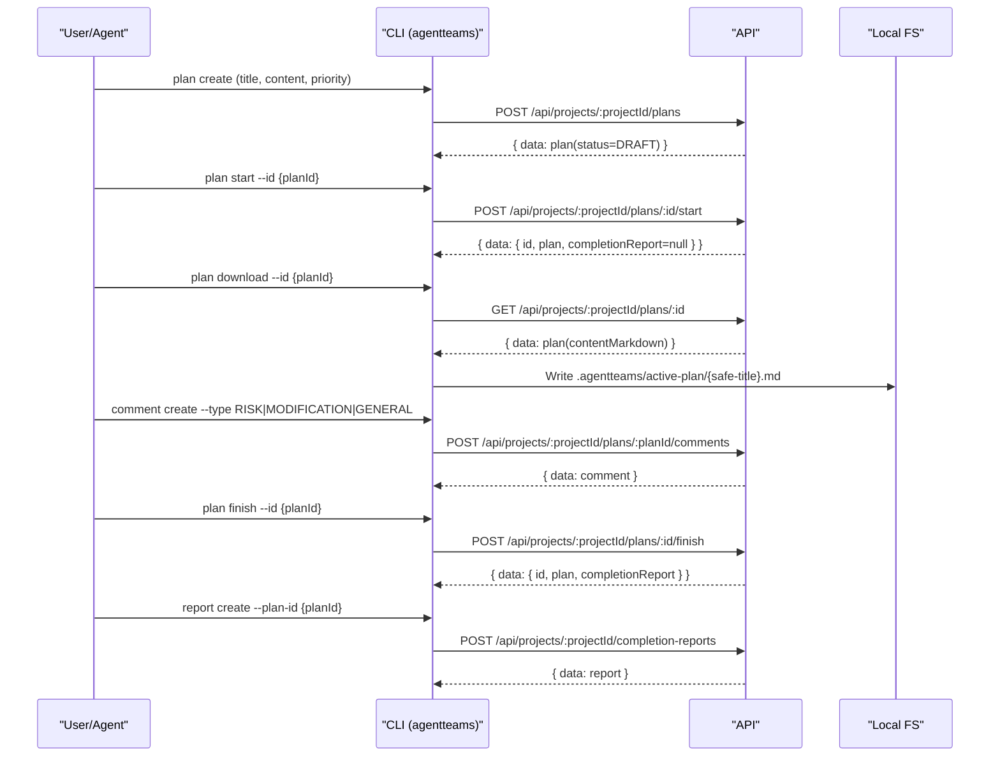
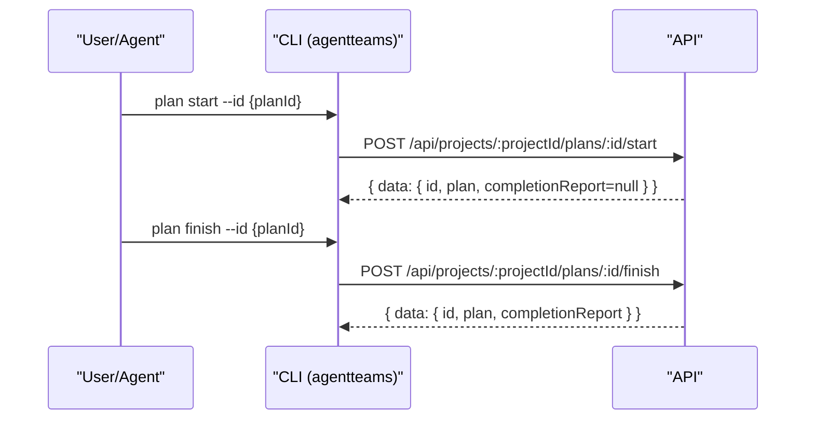

# API ↔ CLI 워크플로우

이 문서는 AgentTeams CLI(`agentteams`)가 API 서버와 어떻게 통신하는지, 그리고 그 결과로 로컬 워크스페이스에 어떤 파일이 생성/업데이트되는지를 설명합니다.

## 범위(Scope)

- CLI 인증/설정(config) 로딩 규칙
- 요청/응답 컨벤션(엔벨로프, 페이지네이션)
- 엔드투엔드 흐름(Plan → Comments/Status → Completion Report → Postmortem)
- CLI가 생성하는 로컬 파일 위치 및 역할
- (추가) 공통 출력 UX(`--output-file`, `--verbose`)와 단축 워크플로우(`plan start/finish`)

> 최종 소스 오브 트루스는 코드입니다. 이 문서는 운영/사용 가이드입니다.

---

## 구성 요소와 책임

- CLI(`/cli`)
  - 커맨드 파싱: `commander`
  - HTTP 호출: `axios`
  - 설정 로딩: `.agentteams/config.json`, `~/.agentteams/config.json`, `AGENTTEAMS_*`
  - 로컬 아티팩트 생성: 플랜 스냅샷(runbook), 컨벤션/가이드 다운로드 파일
  - (추가) 공통 출력 UX: `--output-file`, `--verbose`
  - (추가) 단축 워크플로우: `agentteams plan start|finish`
- API(`/api`)
  - REST API: Fastify
  - 인증/권한: 주로 `X-API-Key` 기반
  - DB 접근: Prisma
  - Swagger UI: `/docs`

---

## 인증(Authentication)과 설정(Config) 로딩

### `agentteams init` (최초 설정)

개요 흐름:

1. 로컬 OAuth 콜백 서버를 실행합니다.
2. 브라우저에서 authorize 페이지를 엽니다(SSH 환경에서는 URL을 출력).
3. `apiUrl`, `apiKey`, `teamId`, `projectId`, `agentName`을 수신하고 로컬에 저장합니다.
4. 컨벤션 템플릿을 `.agentteams/convention.md`로 저장합니다.
5. 컨벤션/플랫폼 가이드를 `.agentteams/*`로 다운로드합니다.


### 설정 우선순위(높음 → 낮음)

1. CLI option overrides (some commands only)
2. Env vars `AGENTTEAMS_*`
3. Project config: nearest `.agentteams/config.json` found by walking up from `cwd`
4. Global config: `~/.agentteams/config.json`

지원 환경변수:

- `AGENTTEAMS_API_KEY`
- `AGENTTEAMS_API_URL`
- `AGENTTEAMS_TEAM_ID`
- `AGENTTEAMS_PROJECT_ID`
- `AGENTTEAMS_AGENT_NAME`

### 기본 요청 헤더

- `X-API-Key: key_...`
- `Content-Type: application/json`

예외:

- `DELETE` 요청은 서버의 빈 JSON body 검증 충돌을 피하기 위해 `Content-Type`을 포함하지 않습니다.

API는 다음 중 하나를 허용합니다:

- `Authorization: Bearer <token>`
- `X-API-Key: key_...` (API keys must have the `key_` prefix)

---

## 공통 API 컨벤션

### Base URL

The CLI calls `{apiUrl}/api/...`.

Example: `GET {apiUrl}/api/projects/{projectId}/plans`

### Response envelopes

- Single: `{ data: {...} }`
- List: `{ data: [...], meta: {...} }`
- Error: `{ statusCode, error, message, errorCode? }`

에러 응답의 `errorCode`는 선택 필드이며, CLI는 `errorCode`가 있을 때 이를 우선 사용해 에러를 분기합니다.
`errorCode`가 없는 구버전/부분 적용 응답에서는 기존 `statusCode + message` 기반 동작으로 fallback합니다.

### Pagination

Many list endpoints accept `page` and `pageSize`.

---

## 공통 출력 UX(추가)

### `--output-file <path>` / `--verbose`

대상(주요 커맨드 전반): `init`, `sync`, `status`, `plan`, `comment`, `report`, `postmortem`, `dependency`, `agent-config`, `config`, `convention`

- `--output-file <path>`
  - “원래 stdout에 출력될 전체 결과”를 지정한 파일에 그대로 저장합니다.
  - stdout에는 기본적으로 **요약 1~3줄**만 출력합니다.
  - 상대 경로는 `cwd` 기준이며 내부에서 `path.resolve`로 절대경로로 변환합니다.
  - 부모 디렉토리가 없으면 생성합니다.
- `--verbose`
  - `--output-file`과 함께 사용하면 stdout에도 전체 결과를 출력합니다(파일 저장은 유지).

요약 출력은 기본 영어 메시지로 출력됩니다(자동화/로그 파싱 관점에서 고정된 문구를 선호).

text 출력에서 객체 필드는 핵심 식별 필드(`id/title/status/priority/updatedAt/createdAt`)를 우선 표시한 뒤 나머지를 정렬해 출력합니다.

---

## 커맨드별 워크플로우

### Plan

- Create: `POST /api/projects/:projectId/plans`
  - Plans are always created as `DRAFT` (server-enforced). Even if a client sends `status`, it will be ignored on creation.
  - Use `--content` or `--file` for the body.
  - `--template refactor-minimal`로 최소 리팩터링 체크리스트 본문을 자동 채울 수 있습니다(내용이 비어 있을 때).
  - `--template quick-minimal`로 약식 작업 계획서(최소 템플릿)를 자동 채울 수 있습니다(내용이 비어 있을 때).
  - 멀티라인을 `--content`로 전달해야 하는 경우, `--interpret-escapes`를 사용하면 `\\n` 시퀀스를 실제 줄바꿈으로 변환합니다(기본 OFF).
- Get alias: `plan show --id <id>`는 `plan get --id <id>`와 동일 동작입니다.
- Include dependencies: `plan get|show --id <id> --include-deps`
  - 내부적으로 `GET /plans/:id` + `GET /plans/:id/dependencies`를 호출해 응답을 합성합니다.
  - `--format json`: `data.dependencies = { blocking: [...], dependents: [...] }`
  - `--format text`: Plan 필드 출력 뒤 `## Dependencies` 섹션을 추가합니다.
- Download snapshot: `GET /api/projects/:projectId/plans/:id`
  - Saved to `.agentteams/active-plan/{safe-title}.md` with frontmatter.
- (추가) 단축 커맨드
  - `agentteams plan start --id <planId>`
    - 내부적으로 `POST /api/projects/:projectId/plans/:id/start`를 호출합니다.
    - 서버는 플랜을 `IN_PROGRESS`로 변경하고(`startedAt` 포함), 필요 시 `assignedTo`를 함께 설정합니다.
  - `agentteams plan finish --id <planId>`
    - 내부적으로 `POST /api/projects/:projectId/plans/:id/finish`를 호출합니다.
    - 요청에 completion report payload가 포함되면, 서버는 completion report를 생성합니다.
    - (추가) `--report-template minimal`을 사용하면 completion report 본문 템플릿을 자동으로 첨부할 수 있습니다.
      - `--report-content` 또는 `--report-file`이 제공되면 `--report-template`은 무시됩니다.

### Comment (plan-scoped)

- List: `GET /api/projects/:projectId/plans/:planId/comments`
- Create: `POST /api/projects/:projectId/plans/:planId/comments`
- Get/Update/Delete by ID: `GET/PUT/DELETE /api/projects/:projectId/comments/:id`

Types: `RISK`, `MODIFICATION`, `GENERAL`

### Convention

Convention commands are tightly coupled to `.agentteams/`.

- Sync download: `agentteams sync` (internally runs `convention download`)
  - Writes conventions and platform guides under `.agentteams/`
  - Updates `.agentteams/conventions.manifest.json`
- Create/Update/Delete: `agentteams convention create|update|delete`
  - Files are expected under `.agentteams/<category>/...`
  - `update/delete` default to a non-destructive preview; use `--apply` to execute.

### Completion report / Postmortem

- Completion reports: `.../completion-reports`
- Postmortems: `.../post-mortems`

CLI supports `--api-url`, `--api-key`, `--team-id`, `--project-id`, `--agent-name` overrides for environments without local config.

#### (추가) `report create`의 템플릿/Deprecated 옵션

- `--template minimal`
  - `--content`가 없을 때 최소 템플릿을 자동으로 채워서 생성할 수 있습니다.
- Deprecated(호환 유지, 경고 출력)
  - `--summary`: `--title`의 별칭(Deprecated)
  - `--details`: `--content`가 없을 때 Details 섹션으로 삽입(Deprecated)

---

## CLI가 생성/관리하는 로컬 파일

- Project config: `.agentteams/config.json`
- Global config: `~/.agentteams/config.json`
- Convention template: `.agentteams/convention.md`
- Download manifest: `.agentteams/conventions.manifest.json`
- Plan snapshots: `.agentteams/active-plan/*.md`
- Output capture: `--output-file <path>`로 지정한 임의 경로(사용자 지정)

---

## 엔드투엔드: plan 생성 → 완료 보고서



## 엔드투엔드(추가): plan start / plan finish



---

## Plan status model and constraints

### Status values

- `DRAFT`
- `PENDING`
- `ASSIGNED`
- `IN_PROGRESS`
- `BLOCKED`
- `DONE` (terminal)
- `CANCELLED` (terminal)

### Allowed status transitions (server-validated)


If you attempt a disallowed transition, the API returns `400` with `허용되지 않은 상태 전이입니다`.

### `plan assign` behavior

`agentteams plan assign` sets the plan to `ASSIGNED` as long as the plan is not terminal.

- Not allowed when current status is `DONE` or `CANCELLED`
- Otherwise allowed and results in `ASSIGNED`

### Content edit/delete constraints (status-based)


---

## Completion report writing rules (practical)

- Prefer the platform template if available: `.agentteams/platform/guides/completion-report-guide.md`
- Include reproducible verification evidence (commands + outcomes).
- Keep outcomes short: write `pass/fail + 1–3 lines of summary`; do not paste long raw logs into the report body.

---

## Troubleshooting

- `401 Unauthorized`
  - Check `AGENTTEAMS_API_KEY` / `.agentteams/config.json` `apiKey`.
  - API keys must have the `key_` prefix.
- `403 Forbidden`
  - You likely lack project/role permissions (especially for convention writes).
- `400 Bad Request`
  - 플랜 상태 전이처럼 서버가 검증하는 제약을 위반했을 수 있습니다.
  - 예: 허용되지 않은 상태 전이 시 `400` + `허용되지 않은 상태 전이입니다`
- Connection issues (`ECONNREFUSED`, `ENOTFOUND`)
  - Check `AGENTTEAMS_API_URL` / config `apiUrl`, and ensure the server is reachable.

---

## 최소 사용 예시

```bash
# First-time setup
agentteams init

# Create plan (always DRAFT)
agentteams plan create --title "My plan" --content "# TODO\n- ..." --priority MEDIUM

# Download local snapshot/runbook
agentteams plan download --id <planId>

  # Add a risk comment
  agentteams comment create --plan-id <planId> --type RISK --content "Potential failure mode..."

  # Move plan forward (manual)
  agentteams plan update --id <planId> --status IN_PROGRESS
  agentteams plan update --id <planId> --status DONE

  # Start/finish shortcuts
  agentteams plan start --id <planId>
  agentteams plan finish --id <planId>
  agentteams plan finish --id <planId> --report-template minimal

# Create completion report (recommended flags)
agentteams report create --plan-id <planId> --title "Done" --template minimal
```

Environment-only mode (no config file):

```bash
export AGENTTEAMS_API_URL="https://..."
export AGENTTEAMS_API_KEY="key_..."
export AGENTTEAMS_TEAM_ID="..."
export AGENTTEAMS_PROJECT_ID="..."
export AGENTTEAMS_AGENT_NAME="..."

agentteams plan list --page 1 --page-size 20
```
